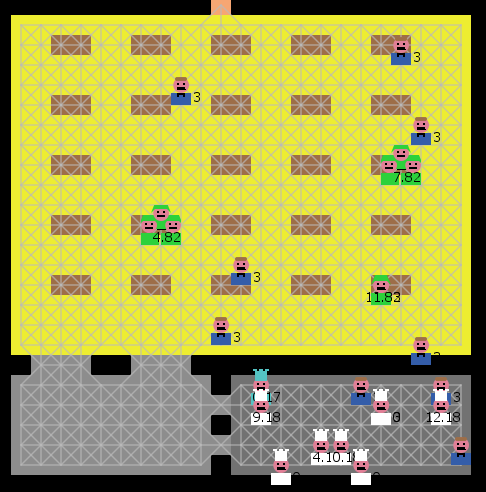

# MAS4CHICKEN
## Autores
- Nander Emanuel Meléndez Huamanchumo
- Jack Yefri Cruz Mamani

## ¿Qué es?

MAS4CHICKEN es un simulador basado en Sistemas Multiagente, el cual simulará el comportamiento entre Cocineros, Meseros y Comensales.

## ¿Cómo funciona?

Primero, se tiene que cargar el mapa a evaluar. Luego, se tienen que ajustar los parámetros deseados. Una vez que estos estén adecuadamente configurados, se procede a iniciar la simulación.

## ¿Cómo se usa?

Empezamos por cargar el mapa del restaurante deseado.Una vez completado este paso, procedemos a "Inicializar el programa". Este proceso depende de varios factores: el mapa cargado, el número de meseros y de cocineros, el intervalo de clientes, y el Intervalo de demora del personal. Al inicializar el programa, se generarán los nodos sobre los cuales se desplazarán los agentes. Asimismo, se generarán los agentes en sus respectivos espacios.

Para empezar la simulación, se debe presionar "Simular". Durante la ejecución del modelo, se puede modificar una variable llamada "Intervalo-Clientes", el cual determina el intervalo de tiempo cuando un nuevo cliente aparecerá en el sistema, e "Intervalo-Demora", el cual determina el intervalo de tiempo cuando un mesero o cocinero pasa a un estado no disponible, esto representa el tiempo empleado en los servicios higiénicos, un accidente no grave, o una llamada importante.

Para monitorear el desempeño de los agentes, se tienen los siguientes elementos:

- Tiempo promedio de espera (min).
- Gráfica del trabajo total por tiempo transcurrido.
- Contador de HH:MM:SS.
- Conteo de Clientes Satisfechos/No Satisfechos.
- Porcentaje de Clientes Satisfechos.

## Para probar

Previo a la inicialización, se pueden modificar tres variables: El conteo de cocineros y meseros, y el intervalo de clientes. Las dos primeras tienen que ser valores mayores a 1. La variable de intervalo de clientes puede ser modificada incluso durante la ejecución. Esta se encuentra en un rango de 1 a 100. Recordar que esta indica intervalo de llegade de nuevos clientes.

## Extendiendo el modelo

Se puede extender el modelo añadiendo visualización en 3D y ejecutando algorítmos de grafos más sofisticados.

## A tomar en cuenta

El presente modelo está diseñado para ser ejecutado en la versión de escritorio de NetLogo, debido a que la versión web carece de ciertas características tales como: entrada/salida de archivos, librerías como nw (grafos) manejo de imágenes (bitmap), etc.
